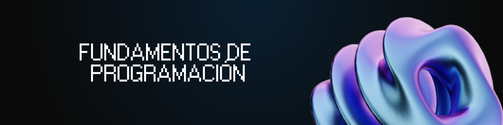

<h1 align="center">
  <a name="logo"></a>
</h1>

<h4 align="center">¿Este repo te fue útil? Dale una ⭐
  </br> 
  Si encontrás algún error o querés colaborar con el proyecto, hacé un 
  <a href="https://github.com/davidgimenezs/fundamentos-de-programacion">pull request</a>!
</h4>

## 📚 ¿Qué es Fundamentos de Programación?
Fundamentos de Programación es una materia introductoria en la formación de cualquier estudiante de ingeniería. Su objetivo principal es enseñar los conceptos básicos de la programación usando Python, desde variables y estructuras de control hasta el manejo de datos con NumPy y visualización con Matplotlib.

## 🤔 ¿Por qué usamos Python en programación?
Usamos Python porque es un lenguaje versátil, fácil de aprender y muy poderoso. Su sintaxis clara permite enfocarse en los conceptos de programación sin complicaciones innecesarias. Además, cuenta con bibliotecas increíbles como NumPy y Matplotlib que hacen el análisis de datos y la visualización muy accesibles.

## 🧠 ¿Cómo se usa Python en programación?
Se usa como herramienta fundamental para resolver problemas. Por ejemplo:

- Usamos ***variables y tipos de datos*** para almacenar información.
- Usamos ***estructuras condicionales y bucles*** para controlar el flujo del programa.
- Usamos ***funciones y recursividad*** para modularizar y reutilizar código.
- Usamos ***listas, tuplas y diccionarios*** para organizar datos de forma eficiente.
- Usamos ***NumPy*** para trabajar con matrices y cálculos numéricos.
- Usamos ***Matplotlib*** para crear gráficos y visualizar datos.

En programación real, cada concepto tiene casos ideales de uso, y parte del aprendizaje es saber cuándo conviene usar cada uno.

## Unidad 1 - Introducción a la Computación

|  #  |  Título  |  Dificultad                 
|-----|----------|--------------
|1|[Hola Mundo](01.%20Introducción/hola_mundo.py) | 🟢 Fácil
|2|[Interés Compuesto](01.%20Introducción/interes_compuesto.py) | 🟢 Fácil
|3|[Primer Dígito de una Suma](01.%20Introducción/primer_digito_suma.py) | 🟡 Intermedio
|4|[Velocidad Final](01.%20Introducción/velocidad_final.py) | 🟢 Fácil

## Unidad 2 - Fundamentos de Programación (Estructuras de Selección)

|  #  |  Título  |  Dificultad                 
|-----|----------|--------------
|5|[Carácter es Letra](02.%20Selección/caracter_letra.py) | 🟢 Fácil
|6|[Cuadrado de un Número](02.%20Selección/cuadrado_numero.py) | 🟢 Fácil
|7|[Fecha Siguiente](02.%20Selección/fecha_siguiente.py) | 🟡 Intermedio
|8|[Jornal de Empleado](02.%20Selección/jornal_empleado.py) | 🟡 Intermedio
|9|[Número Binario](02.%20Selección/numero_binario.py) | 🔴 Difícil
|10|[Positivo, Negativo o Cero](02.%20Selección/positivo_negativo_cero.py) | 🟢 Fácil
|11|[Valor Central](02.%20Selección/valor_central.py) | 🟡 Intermedio

## Unidad 3 - Programación Estructurada (Repetición y Funciones)

|  #  |  Título  |  Dificultad                 
|-----|----------|--------------
|12|[Análisis de Ruleta](03.%20Repetición/analisis_ruleta.py) | 🟡 Intermedio
|13|[Árbol de Navidad](03.%20Repetición/arbol_navidad.py) | 🟡 Intermedio
|14|[Invertir Dígitos](03.%20Repetición/invertir_digitos.py) | 🟡 Intermedio
|15|[MCD Euclides](03.%20Repetición/mcd_euclides.py) | 🔴 Difícil
|16|[Número Primo](03.%20Repetición/numero_primo.py) | 🟡 Intermedio
|17|[Porcentaje de Edades](03.%20Repetición/porcentaje_edades.py) | 🟡 Intermedio
|18|[Sucesión Fibonacci](03.%20Repetición/sucesion_fibonacci.py) | 🟡 Intermedio

## Unidad 4 - Estructuras de Datos

|  #  |  Título  |  Dificultad                 
|-----|----------|--------------
|19|[Contar Vocales](04.%20Datos/contar_vocales.py) | 🟢 Fácil
|20|[Desplazar Lista a la Derecha](04.%20Datos/desplazar_lista_derecha.py) | 🟡 Intermedio
|21|[Mayor y Menor de una Lista](04.%20Datos/mayor_menor_lista.py) | 🟢 Fácil
|22|[Número de Apariciones](04.%20Datos/numero_apariciones.py) | 🟢 Fácil
|23|[Suma y Promedio de Positivos](04.%20Datos/suma_promedio_positivos.py) | 🟢 Fácil

## Unidad 5 - Funciones y Recursividad

|  #  |  Título  |  Dificultad                 
|-----|----------|--------------
|24|[Cantidad de Primos en Dígitos](05.%20Funciones/cantidad_primos_digitos.py) | 🟡 Intermedio
|25|[Cifrado de Número](05.%20Funciones/cifrado_numero.py) | 🔴 Difícil
|26|[Combinaciones sin Repetición](05.%20Funciones/combinaciones_sin_repeticion.py) | 🔴 Difícil
|27|[Diamante](05.%20Funciones/diamante.py) | 🟡 Intermedio
|28|[Generador Pseudoaleatorio](05.%20Funciones/generador_pseudoaleatorio.py) | 🔴 Difícil
|29|[Generar Números Primos](05.%20Funciones/generar_numeros_primos.py) | 🟡 Intermedio
|30|[Monte Carlo](05.%20Funciones/monte_carlo.py) | 🔴 Difícil
|31|[Números Amigos](05.%20Funciones/numeros_amigos.py) | 🔴 Difícil
|32|[Números Armstrong y Perfectos](05.%20Funciones/numeros_armstrong_y_perfectos.py) | 🟡 Intermedio
|33|[Triángulo Isósceles](05.%20Funciones/triangulo_isosceles.py) | 🟡 Intermedio

### Recursividad

|  #  |  Título  |  Dificultad                 
|-----|----------|--------------
|34|[Binario Recursivo](06.%20Recursividad/binario_recursivo.py) | 🟡 Intermedio
|35|[Factorial Recursivo](06.%20Recursividad/factorial_recursivo.py) | 🟢 Fácil
|36|[Fibonacci Recursivo](06.%20Recursividad/fibonacci_recursivo.py) | 🟡 Intermedio
|37|[Invertir Recursivo](06.%20Recursividad/invertir_recursivo.py) | 🟡 Intermedio
|38|[MCD Recursivo](06.%20Recursividad/mcd_recursivo.py) | 🟡 Intermedio

## Unidad 6 - NumPy para Manejo de Matrices

|  #  |  Título  |  Dificultad                 
|-----|----------|--------------
|39|[Ascendente por Columnas](07.%20Numpy/ascendente_columnas.py) | 🟡 Intermedio
|40|[Ascendente por Filas](07.%20Numpy/ascendente_filas.py) | 🟡 Intermedio
|41|[Ordenar Mitades](07.%20Numpy/ordenar_mitades.py) | 🔴 Difícil
|42|[Sumar Arrays](07.%20Numpy/sumar_arrays.py) | 🟢 Fácil

## Unidad 7 - Visualización de Datos y Búsqueda/Ordenamiento

### Visualización con Matplotlib

|  #  |  Título  |  Dificultad                 
|-----|----------|--------------
|43|[Monte Carlo con Matplotlib](08.%20Visualización/montecarlo_matplotlib.py) | 🔴 Difícil
|44|[Ruido en Imagen](08.%20Visualización/ruido_imagen.py) | 🟡 Intermedio

### Algoritmos de Búsqueda y Ordenamiento

|  #  |  Título  |  Dificultad                 
|-----|----------|--------------
|45|[Listas Iguales](09.%20Búsqueda/listas_iguales.py) | 🟢 Fácil
|46|[Método Burbuja](09.%20Búsqueda/metodo_burbuja.py) | 🟡 Intermedio
|47|[Ordenar Alumnos](09.%20Búsqueda/ordenar_alumos.py) | 🟡 Intermedio
|48|[Ordenar Fechas](09.%20Búsqueda/ordenar_fechas.py) | 🟡 Intermedio
|49|[Ordenar Matrices](09.%20Búsqueda/ordenar_matrices.py) | 🔴 Difícil
|50|[Reducir Listas](09.%20Búsqueda/reducir_listas.py) | 🟡 Intermedio

## 🛠️ Instrucciones de uso

1. Cloná el repositorio en tu máquina local:
   ```bash
   git clone https://github.com/davidgimenezs/fundamentos-de-programacion.git
   ```

2. Navegá a la carpeta del repositorio:
   ```bash
   cd fundamentos-de-programacion
   ```

3. Ejecutá cualquier archivo Python:
   ```bash
   python "01. Introducción/hola_mundo.py"
   ```

4. Para los ejercicios de NumPy y Matplotlib, asegurate de tener las librerías instaladas:
   ```bash
   pip install numpy matplotlib
   ```

## 🤝 Colaboración
Si encontrás algún error o querés agregar algo al proyecto, ¡estás más que bienvenido! Hacé un [pull request](https://github.com/davidgimenezs/fundamentos-de-programacion/pulls) con tus mejoras, correcciones o nuevos ejercicios y lo reviso sin problema.

## 📄 Licencia
Este proyecto está bajo la licencia MIT - podés ver más detalles en el archivo LICENSE.
